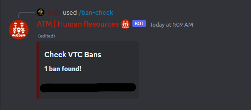

# Ban Check Command
```ts
data: new SlashCommandBuilder()
    .setName("ban-check")
    .setDescription("Checks the TMP VTC for any outstanding bans.")
```

## Required Permit
**Permit Level 7 - HR Associate Access**

## Usage
`/ban-check` - no arguments.

## Returns
An embed that is periodically populated with details from the ban check. The actual methodology is as follows:
1. **Members are fetched from the VTC.** If this process errors out, this GET operation will return an empty array of members, meaning none are checked. This is a **soft fail.** If you notice repeated soft fails, please submit a [bug report].
2. **Members are polled concurrently for their ban status.** If this process errors out, this GET operation will return a null, which is the same as a false ban status. Again, please report if you notice subsequence soft fails.
3. **Members are filtered for banned users, and passed to the embed for updating.** This includes their TruckersMP username, the hyperlink to their profile embedded in the name, and their Discord ID if available.

The result is a final array that has a count and a list of banned users currently in the VTC.

{: .info }
> Please note that this does not include ban reason, duration, or total ban count for any members, as this is not necessarily immediately relevant and encourages manual investigation over automatic enforcement.



[bug report]: https://at-the-mile.github.io/docs/hr/bug-report.html