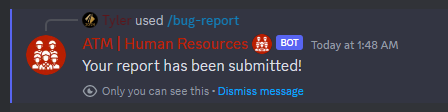

# Ping Command
```ts
data: new SlashCommandBuilder()
    .setName("bug-report")
    .setDescription("Reports a bug to the developers.")
```

{: .warning }
> Misuse of this command will result in mutes, kicks, or bans at the discretion of the DevOps and Human Resources teams!


## Required Permit
**Permit Level 0 - Basic Access**

## Usage
`/bug-report <comment>`
- **comment** - the desired report comment to attach. **Please make this simple but as descriptive as possible!** A great example would be "when using the search user command, I experience frequent crashes when looking for lots of users." Follow the general format of **situation, outcome, inputs!**

## Returns
An affirmative response that your report has been received. It is then passed to the DevOps team for triage.



## Trivia
- There are actionable plans to move reporting a Linear-supported system in the future. However, for ergonomics, Discord was chosen as an easy solution.