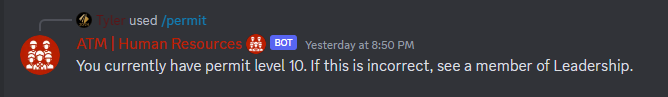

# Permit Check Command
```ts
data: new SlashCommandBuilder()
    .setName("permit")
    .setDescription("Checks command access permit level.")
```
## Required Permit
**Permit Level 0 - Basic Access**
## Usage
`/permit` - no arguments.

## Returns
Your current permit level. Permits operate on a fixed scale, with global access permissions. Permits cannot be manually altered - there are internally, statically defined by other permissions.

- **Permit Level 0** - Basic Access. You have access to all commands in the public view. You have no edit access to any details except your own vanity details.
- **Permit Level 7** - HR Associate Access. Has access to most commands for member-by-member management, but has no access to bulk commands or remote user editing.
- **Permit Level 8** - HR Management Access. Has all the above access, plus some non-destructive permissions for bulk member management.
- **Permit Level 9** - Leadership Access. Has access to all operational capacities of the bot.
- **Permit Level 10** - Reserved for DevOps team members on a case-by-case basis.



## Trivia
- The reason the scale jumps from 0 to 7 was a DevOps early allocation for future staff access. It is unknown what middle-ground access staff will have as of right now.