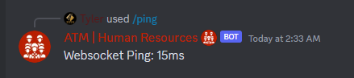

# Ping Command
```ts
data: new SlashCommandBuilder()
    .setName("ping")
    .setDescription("Returns the websocket ping and other important data.")
```

{: .info-title }
> Developer Information
> 
> This information is largely unimportant if you aren't a project developer. However, to aid the community in communicating errors, we've exposed the websocket details.

## Required Permit
**Permit Level 0 - Basic Access**

## Usage
`/ping` - no arguments.

## Returns
Some sample output of the websocket ping.

