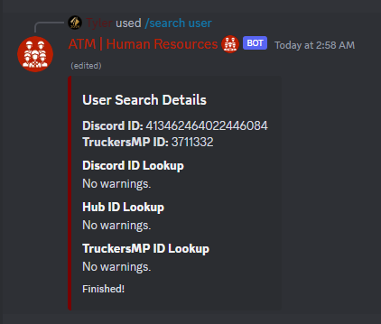

# Search Commands
```ts
data: new SlashCommandBuilder()
    .setName("search")
    .setDescription("Search utilities across various APIs.")
```

{: .info-title }
> Subcommands
>
> This command consists of various subcommands. They are listed here in order of development.

## Search User

### Required Permit
**Permit Level 7 - HR Associate Access**

### Usage:
`/search user <discord_id> [tmp_id]`
- **discord_id** - the Discord ID snowflake of the target user. **Mandatory.**
- **tmp_id** - the TruckersMP ID of the target user. **Optional** - witholding this ID will disable TMP searching.

### Returns:
A comprehensive report of the user's **Discord** punishment states, **Hub** punishment states, and **TruckersMP** punishment state and history among other facts. The following are examples are information that is automatically checked:
- Is the user banned from the server?
- Is the user banned from the hub?
- Is the user banned from TruckersMP?
- Has the user accumulated more than 2 active bans on TruckersMP?
- Has the user hidden their punishment history?
- Does the user have recent extensive VTC history?

**All of this information is made publicly available by the TruckersMP V2 API. If you have any data concerns, we are not the ones you want to take them up with.** We do not retain any user data for caching, profiling, applications, etc. All data is gathered just-in-time and discarded thereafter.



{: .warning }
> As noted above, omitting the TruckersMP ID will disable the TruckersMP search. **This is a fairly large portion of the search,** but if you're just looking for Discord/Hub histories, the Discord ID will suffice.